<div align="center">

## 🎧 HelpDesk

Control your PC keyboard and mouse directly from your phone.
This project combines a Go backend (using RobotGo) with a Flutter mobile app to give you remote control over your device.

**A role-based support & ticketing platform** — a Laravel 10 REST API backend paired with an Angular 20 (TailAdmin) frontend.

Users open support tickets, agents resolve the tickets assigned to them, and admins triage everything: users, agents, categories, FAQs and ticket assignment.


</div>

---

## 📑 Table of Contents

- [Overview](#-overview)
- [Screenshots](#-screenshots)
- [Features](#-features)
- [Tech Stack](#-tech-stack)
- [Installation](#-installation)
- [Run Backend](#-run-backend)
- [Run Frontend](#-run-frontend)
- [Seed Data](#-seed-data)
- [Default Credentials](#-default-credentials)
- [API Overview](#-api-overview)
- [Project Structure](#-project-structure)

---

## 🔎 Overview

HelpDesk is a full-stack support desk built around **three roles**, each with its own dashboard, sidebar and route guards:

| Role | What they can do |
|-------|------------------|
| 👤 **User** | Create tickets, follow their status, reply with comments & attachments, browse FAQs |
| 🎫 **Agent** | See tickets assigned to them, track open/resolved/closed counts, update status |
| 🛡️ **Admin** | Manage users, agents, categories & FAQs; triage every ticket (status / priority / category) and **assign an agent** |

Authentication uses **Laravel Sanctum** tokens with per-role abilities, and every list endpoint supports filtering, search and pagination.

---

## 📸 Screenshots

### Authentication
<p align="center">
  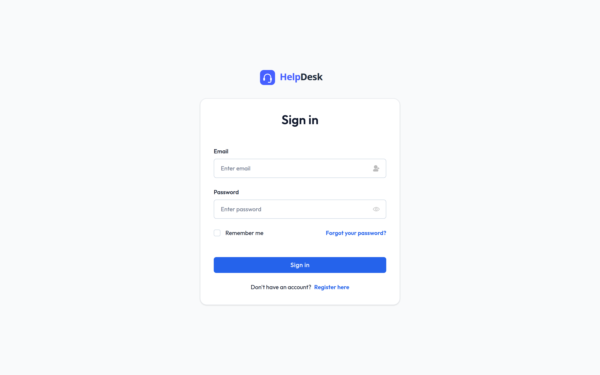
</p>

### Admin
The admin gets a full command center — KPI cards, quick actions, recent activity — plus management screens for tickets, users, agents, categories and FAQs.

| Dashboard | Tickets (triage & assign) |
|:---:|:---:|
| 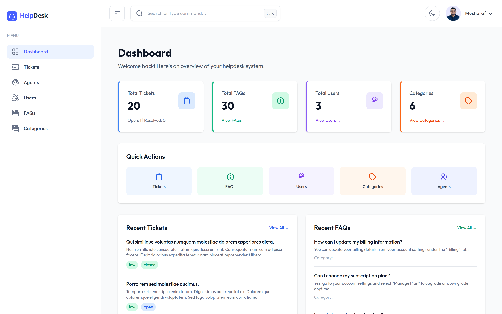 | 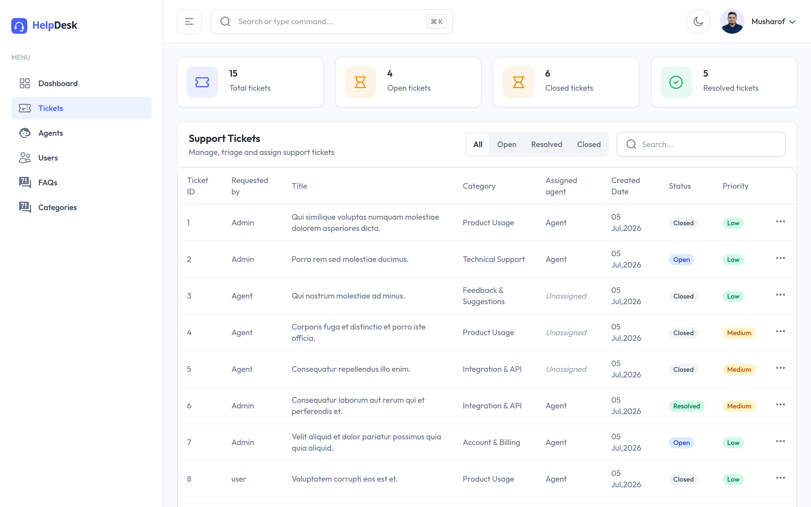 |

| Users | Agents |
|:---:|:---:|
| 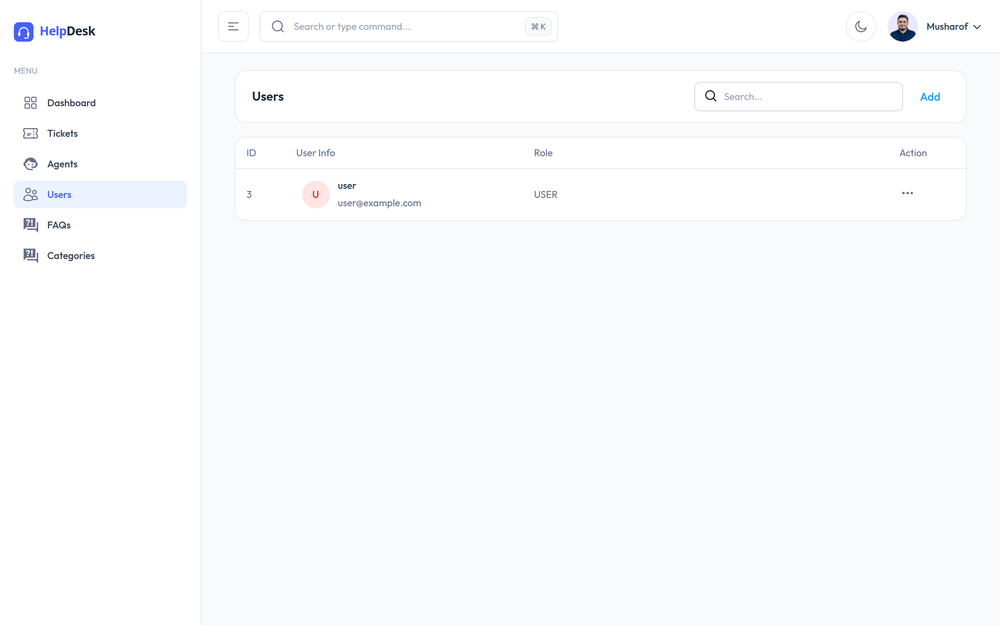 | 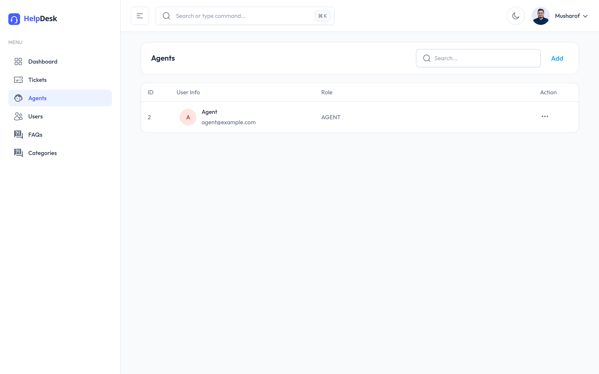 |

| Categories | FAQs |
|:---:|:---:|
| 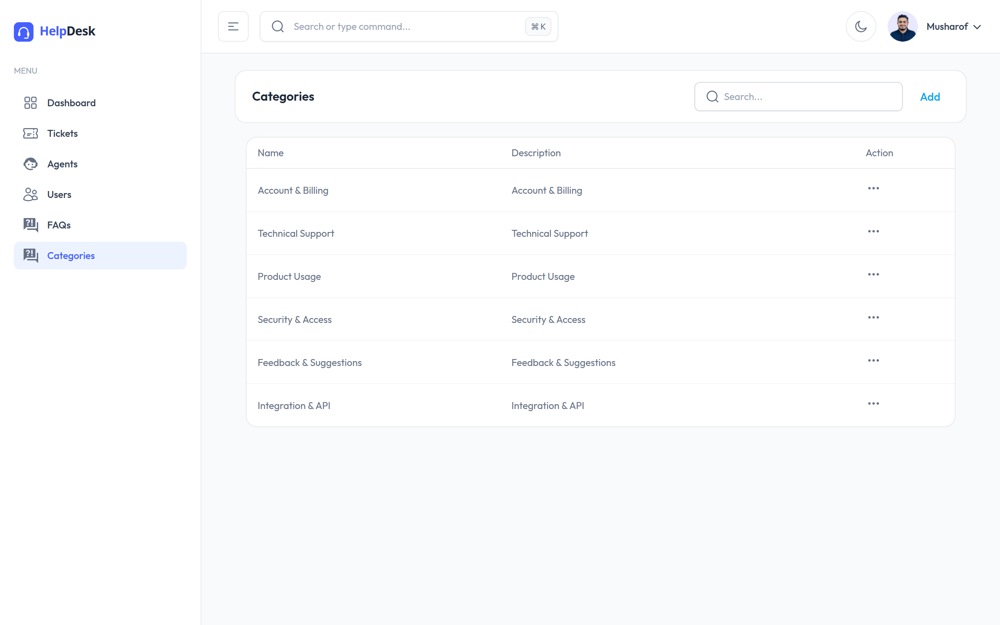 | 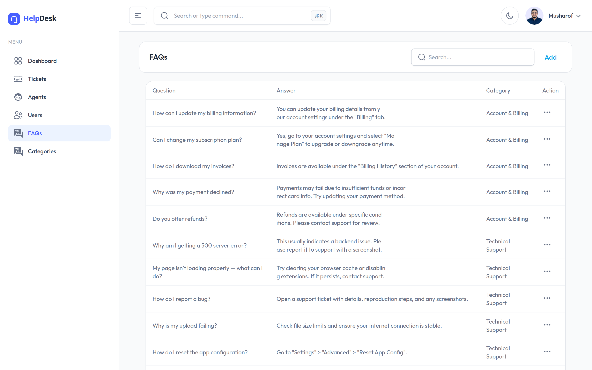 |

### Agent
Agents see only the tickets assigned to them, with live counts for assigned / open / resolved / closed.

| Dashboard | My Tickets |
|:---:|:---:|
| 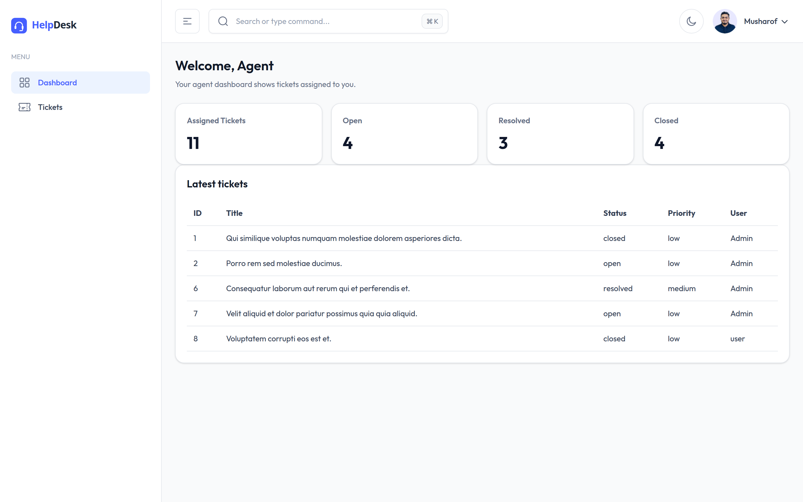 | 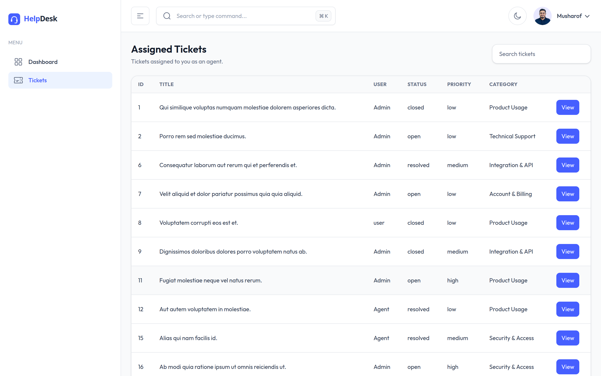 |

### User
End users get a lightweight support portal to raise tickets, track them, and self-serve through FAQs.

| Support Dashboard | My Tickets | FAQs |
|:---:|:---:|:---:|
| 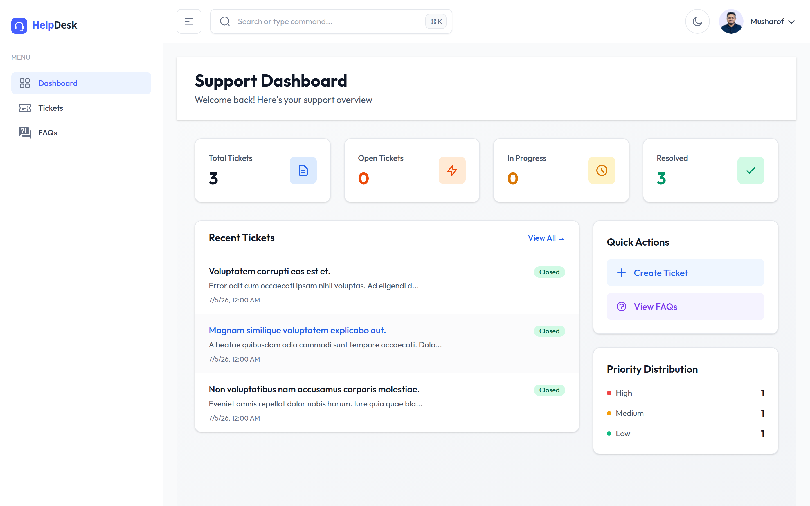 | 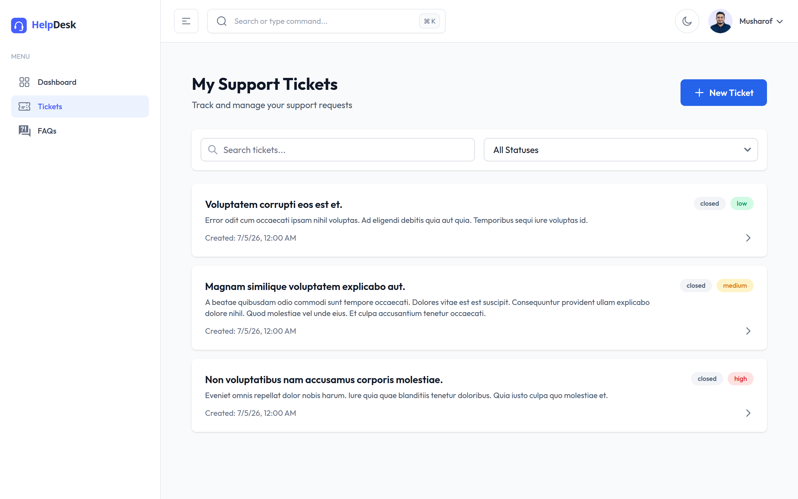 | 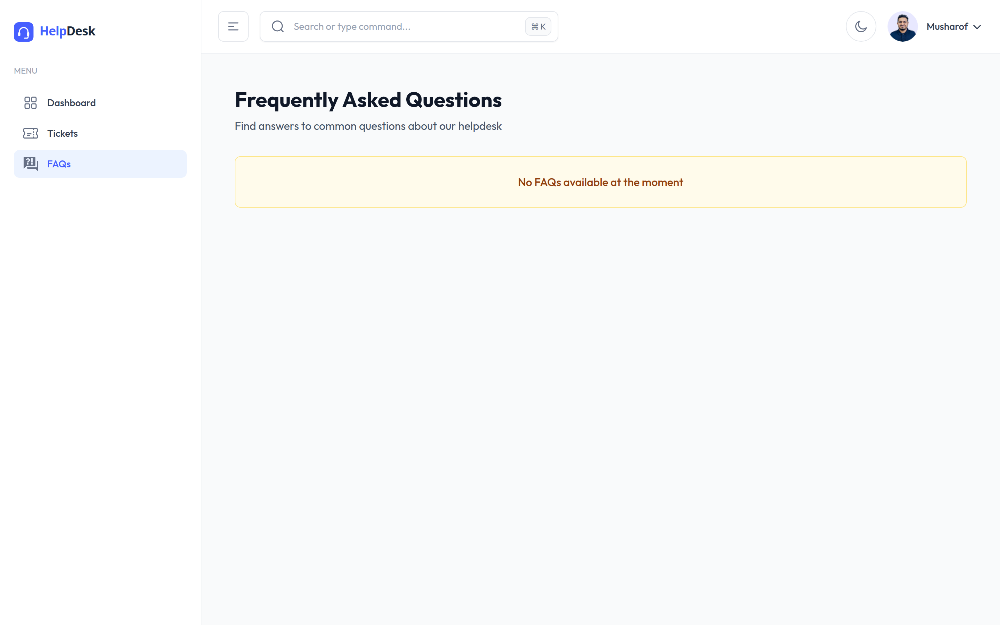 |

---

## ✨ Features

- **Authentication** via Laravel Sanctum tokens with per-role abilities and route guards.
- **Three roles** with dedicated dashboards:
  - **User** – create tickets, browse FAQs, reply to their tickets (with file attachments).
  - **Agent** – view tickets assigned to them and update their status.
  - **Admin** – manage users, agents, categories and FAQs; triage tickets (status / priority / category) and **assign an agent** to any ticket.
- **Tickets** – title, description, priority (`low` / `medium` / `high`), status (`open` / `resolved` / `closed`), category, requester and assigned agent.
- **Comments & attachments** on tickets (stored on the `public` storage disk).
- **FAQs** grouped by category and searchable.
- **Filtering, search and pagination** on the list endpoints.
- **Role-scoped dashboards** with KPI cards, recent activity and quick actions.

---

## 🧰 Tech Stack

**Backend**
- Laravel 10 · PHP 8.1+
- Laravel Sanctum (token auth)
- SQLite (default) or MySQL

**Frontend**
- Angular 20 (standalone components + lazy-loaded route modules)
- TailAdmin UI · Tailwind CSS 4
- PrimeNG · ApexCharts / amCharts · FullCalendar

---

## ⚙️ Installation

```bash
git clone https://github.com/Kazan-2-magma/helpdesk.git
cd helpdesk
```

### Backend (`/backend`)

```bash
cd backend
composer install
cp .env.example .env
php artisan key:generate
```

By default the app is configured for **SQLite** (zero setup). To use it, create the database file and point `.env` at it:

```bash
touch database/database.sqlite
# in .env:
#   DB_CONNECTION=sqlite
#   DB_DATABASE=/absolute/path/to/backend/database/database.sqlite
```

To use **MySQL** instead, keep `DB_CONNECTION=mysql` and fill in `DB_DATABASE`, `DB_USERNAME`, `DB_PASSWORD` in `.env`.

Then run the migrations, seed demo data, and link storage for attachments:

```bash
php artisan migrate:fresh --seed
php artisan storage:link
```

### Frontend (`/helpdesk-frontend`)

```bash
cd helpdesk-frontend
npm install
```

The API base URL is set in `src/environments/environment.ts`:

```ts
baseUrl: "http://localhost:8000/api/v1"
```

---

## ▶️ Run Backend

```bash
cd backend
php artisan serve            # http://localhost:8000
```

---

## ▶️ Run Frontend

```bash
cd helpdesk-frontend
npm start                    # http://localhost:4200
```

After login you are redirected to the dashboard for your role.

---

## 🌱 Seed Data

`php artisan migrate:fresh --seed` seeds:

- **3 demo users** (admin, agent, user)
- **6 categories**
- **30 FAQs**
- **20 sample tickets**

---

## 🔑 Default Credentials

| Role  | Email               | Password    |
|-------|---------------------|-------------|
| Admin | `admin@example.com` | `Admin123!` |
| Agent | `agent@example.com` | `Agent123!` |
| User  | `user@example.com`  | `User123!`  |

---

## 🔌 API Overview

All endpoints are prefixed with **`/api/v1`** and (except `login`) require a Sanctum bearer token:

```
Authorization: Bearer <token>
Accept: application/json
```

### Authentication

| Method | Endpoint      | Auth       | Description                                  |
|--------|---------------|------------|----------------------------------------------|
| `POST` | `/login`      | Public     | Log in, returns a Sanctum token + user/role  |
| `GET`  | `/getUser`    | Any user   | Get the currently authenticated user         |
| `POST` | `/logout`     | Any user   | Revoke the current access token              |

### Tickets

| Method       | Endpoint             | Auth    | Description                                       |
|--------------|----------------------|---------|---------------------------------------------------|
| `GET`        | `/tickets`           | Any     | List tickets (filter / search / paginate)         |
| `POST`       | `/tickets`           | Any     | Create a ticket                                   |
| `GET`        | `/tickets/{id}`      | Any     | Show a ticket (with comments & attachments)       |
| `PUT/PATCH`  | `/tickets/{id}`      | Any     | Update a ticket (admin triage: status/priority/category/assignee) |
| `DELETE`     | `/tickets/{id}`      | Any     | Delete a ticket                                   |
| `GET`        | `/user/userTickets`  | User    | Tickets created by the current user               |
| `GET`        | `/agent/tickets`     | Agent   | Tickets assigned to the current agent             |

### Comments (ticket replies)

| Method       | Endpoint                          | Auth  | Description                          |
|--------------|-----------------------------------|-------|--------------------------------------|
| `POST`       | `/user/tickets/{ticket}/comments` | User  | Add a comment (with attachments)     |
| `GET`        | `/user/comment`                   | User  | List comments                        |
| `POST`       | `/user/comment`                   | User  | Create a comment                     |
| `GET`        | `/user/comment/{id}`              | User  | Show a comment                       |
| `PUT/PATCH`  | `/user/comment/{id}`              | User  | Update a comment                     |
| `DELETE`     | `/user/comment/{id}`              | User  | Delete a comment                     |

### Categories

| Method       | Endpoint             | Auth  | Description        |
|--------------|----------------------|-------|--------------------|
| `GET`        | `/categories`        | Any   | List categories    |
| `POST`       | `/categories`        | Any   | Create a category  |
| `GET`        | `/categories/{id}`   | Any   | Show a category    |
| `PUT/PATCH`  | `/categories/{id}`   | Any   | Update a category  |
| `DELETE`     | `/categories/{id}`   | Any   | Delete a category  |

### FAQs

| Method       | Endpoint            | Auth   | Description                    |
|--------------|---------------------|--------|--------------------------------|
| `GET`        | `/user/faqs`        | User   | Browse FAQs                    |
| `GET`        | `/user/faqs/{id}`   | User   | Show an FAQ                    |
| `GET`        | `/admin/faqs`       | Admin  | List FAQs (management)         |
| `POST`       | `/admin/faqs`       | Admin  | Create an FAQ                  |
| `PUT/PATCH`  | `/admin/faqs/{id}`  | Admin  | Update an FAQ                  |
| `DELETE`     | `/admin/faqs/{id}`  | Admin  | Delete an FAQ                  |

### Users (admin only)

| Method       | Endpoint             | Auth   | Description                    |
|--------------|----------------------|--------|--------------------------------|
| `GET`        | `/admin/users`       | Admin  | List users & agents            |
| `POST`       | `/admin/users`       | Admin  | Create a user / agent          |
| `GET`        | `/admin/users/{id}`  | Admin  | Show a user                    |
| `PUT/PATCH`  | `/admin/users/{id}`  | Admin  | Update a user                  |
| `DELETE`     | `/admin/users/{id}`  | Admin  | Delete a user                  |

> Role access is enforced by the `admin`, `agent` and `auth` middleware groups. Requests are rate-limited to **60 requests/minute** per user (or IP).

---

## 🗂️ Project Structure

```
helpdesk/
├── backend/                 # Laravel 10 REST API
│   ├── app/Http/Controllers # Auth, Ticket, Comment, Category, Faq, User, Attachment
│   ├── database/seeders     # Users, Categories, FAQs, Tickets
│   └── routes/
│       ├── api.php          # login / logout / getUser
│       └── api/v1/api_v1.php # role-scoped resource routes
│
└── helpdesk-frontend/       # Angular 20 (TailAdmin)
    └── src/app/
        ├── auth/            # login
        ├── core/            # guards, interceptors, services
        └── features/
            ├── admin/       # dashboard, tickets, users, agents, categories, faqs
            ├── agent/       # dashboard, tickets
            └── user/        # dashboard, tickets, ticket detail, faqs
```
